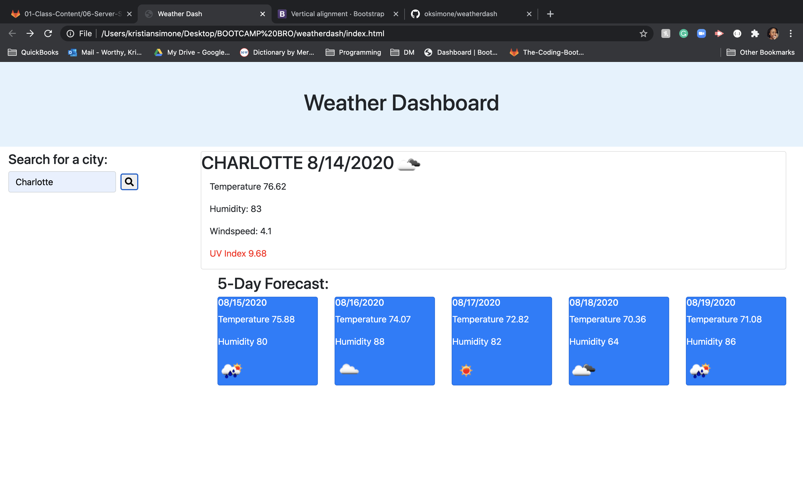

# weatherdash

Weather Dashboard is assignment number 6 of my Full-Stack Bootcamp and this was extremely challenging. I'm still trying to wrap my head around utilizing functions, and using web APIs Even though I'm missing some parts of this assignment, I was able to tackle a good bit of this homework. Below are the requirements of the assignment.

 - the requirements of this assignment was to:
    - seach for a city an 
      - when searching for a city, it presents current and future conditions for the city searched and is added to the search history
    - it also presents the city name, date, the icon of the weather conditions, the temperature and the UV index
    - the assignment should also show a 5-day forecarst that displays the date, an icon of the weather conditions, the temperature, and the humidity
    - and, the assignement should show buttons of the previously searched city with the forecast of that city

When I first started the assignment, I didn't think to code the HTML dynamically through javascript. So, I started hardcoding my sidebar and card decks into the HTML. Then realized later that coding it in a way that wasn't dynamic would have made the assignment much more difficult than it needed to be. The first couple of screenshots I took was when I was coding it not dynamically, and the last photo is my final product. 

